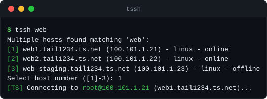
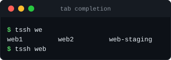
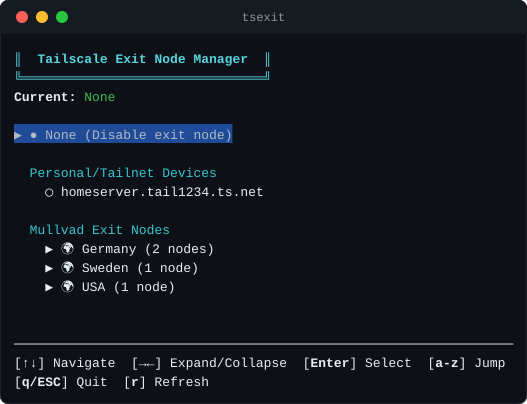

# Tailscale CLI Helpers

Wrappers around `ssh`, `scp`, `sftp`, `rsync`, `ping`, and `mussh` that take a
Tailscale node name instead of an IP. Type part of a name and the wrapper
resolves it against your tailnet, shows a picker when several nodes match, and
then runs the real command.



```bash
tssh web1                      # ssh to the node matching "web1"
tscp report.pdf web1:/tmp/     # scp a file to it
tsping web1                    # ping it
ts web1                        # same as tssh web1
```

## Commands

| Command | What it does |
|---------|--------------|
| `tssh [user@]host [ssh opts]` | SSH to a node. Connects as `root` unless you give `user@`. |
| `tscp [scp opts] src dst` | Copy files with `scp`. |
| `tsftp [user@]host` | Open an `sftp` session (as `root` by default). |
| `trsync [rsync opts] src dst` | Sync with `rsync`. |
| `tsping [ping opts] host` | Ping a node by name. |
| `tssh_copy_id [user@]host` | Install your public key with `ssh-copy-id`; resolves `-J` jump hosts too. |
| `tsexit` | Pick or clear an exit node from a menu. |
| `tmussh -h "web-*" -c "cmd"` | Run a command on several nodes in parallel (needs `mussh`). |

Every command is also a `ts` subcommand: `ts ssh`, `ts scp`, `ts sftp`,
`ts rsync`, `ts ping`, `ts ssh_copy_id`, `ts mussh`, and `ts exit`. `ts <host>`
on its own means `ts ssh <host>`, and `ts` alone prints the subcommand list.
All commands take `-h`/`--help` and `-V`/`--version`, and each has a man page
(`man ts`, `man tssh`, `man tsexit`, ...).

Unrecognized flags pass straight through to the underlying tool, so things
like `tssh web1 -p 2222`, `tscp -r`, and `trsync --delete` work as usual.

## How names resolve

Given a name, the helpers read `tailscale status --json` and try an exact
hostname match, then substring matches, then closest-name (Levenshtein)
matching for near misses. One match connects immediately; several matches show
a numbered picker with online nodes listed first (when stdin isn't a terminal,
the first match is used). Mullvad exit nodes never show up in pickers or
completions.

Connections use the node's Tailscale IP by default. Set
`TAILSCALE_USE_MAGICDNS=1` to connect by MagicDNS name instead; this only
kicks in when MagicDNS is enabled and actually resolving. If a name matches
nothing in the tailnet, `tssh` falls back to plain `ssh` for hosts found in
your `~/.ssh/known_hosts`.

Jump hosts given with `-J` or `-o ProxyJump=` resolve the same way (for
`trsync`, inside `-e "ssh -J host"`; `tmussh -p` proxies too), connecting as
`root` wherever the target would. Behind a jump host, the target can be
anything the jump host reaches, such as an address on its LAN.

Node names coming out of `tailscale status` are validated before use, `jq`
lookups bind values as parameters instead of interpolating strings, and
arguments are passed with `--` separation, so a hostile node name can't turn
into command or option injection.

### Tab completion

Completion for all commands works in bash and zsh, including `user@host`
forms:



## Exit nodes

`tsexit` lists every node offering itself as an exit node. Mullvad nodes are
grouped by country; your own devices get their own section; the active exit
node is marked. `tsexit --list` prints the same information without the menu.



## Requirements

- Bash 4+ (the tools are bash scripts; completions also work in zsh)
- `jq`
- `tailscale`, logged in and running
- `ssh`, plus `scp` / `sftp` / `rsync` / `mussh` for the commands that wrap them

Each wrapper checks for its underlying tool at startup and exits with an error
if it's missing. `setup.sh` skips installing `tmussh` entirely unless `mussh`
is present.

## Install

### From source

```bash
git clone https://github.com/DigitalCyberSoft/tailscale-cli-helpers.git
cd tailscale-cli-helpers
./setup.sh                 # current user
sudo ./setup.sh --system   # system-wide
```

Or from a release tarball:

```bash
wget https://github.com/DigitalCyberSoft/tailscale-cli-helpers/archive/refs/tags/v0.4.0.tar.gz
tar -xzf v0.4.0.tar.gz && cd tailscale-cli-helpers-0.4.0
./setup.sh
```

A user install puts commands in `~/.local/bin`, libraries in
`~/.local/share/tailscale-cli-helpers/`, man pages in `~/.local/share/man/`,
and completions in `~/.local/share/bash-completion/completions/`. Make sure
`~/.local/bin` is on your `PATH`; the installer warns if it isn't.

A system install (requires `--system` and root) uses `/usr/bin`,
`/usr/share/tailscale-cli-helpers/`, `/usr/share/man/man1/`, and
`/etc/bash_completion.d/`. Completions show up in new shells.

Re-running `setup.sh` over an existing installation updates it in place.

### Packages

Download the RPM or DEB from the
[releases page](https://github.com/DigitalCyberSoft/tailscale-cli-helpers/releases),
then:

```bash
sudo dnf install ./tailscale-cli-helpers-*.noarch.rpm    # Fedora/RHEL/CentOS
sudo dpkg -i ./tailscale-cli-helpers_*_all.deb           # Debian/Ubuntu
```

`tmussh` ships separately as `tailscale-cli-helpers-mussh`, since it depends
on `mussh`.

### macOS

```bash
brew install jq tailscale    # dependencies
./setup.sh                   # installs to the user locations above
```

A Homebrew formula (`tailscale-cli-helpers.rb`) is included in the repo for
tap maintainers; current Homebrew no longer installs formulas directly from
URLs, so `setup.sh` is the simplest route.

## Usage

### SSH

```bash
tssh web1                  # connects as root@web1
tssh deploy@web1           # a different user
tssh web1 -p 2222 -i ~/.ssh/id_ed25519
tssh -v web1               # show how the name resolved
tssh -J web1 192.168.1.20  # through web1 to a host on its LAN
ts web1                    # ts shorthand for the same thing
```

### Copying files

```bash
tscp report.pdf web1:/tmp/
tscp web1:/var/log/syslog ./
tscp -J web1 report.pdf 192.168.1.20:/tmp/
tscp -r ./site web1:/var/www/        # recursive
tsftp web1                           # interactive sftp session
```

### Sync

```bash
trsync -av ./site/ web1:/var/www/
trsync -avz --delete --exclude='*.log' ./site/ web1:/var/www/
trsync -av --dry-run ./site/ web1:/var/www/
trsync -av -e "ssh -J web1" ./site/ 192.168.1.20:/var/www/
```

### Ping

```bash
tsping web1
tsping -c 4 web1           # ping flags pass straight through
ts ping web1
```

### SSH keys

```bash
tssh_copy_id web1
tssh_copy_id -i ~/.ssh/id_ed25519.pub deploy@web1
tssh_copy_id -J jumphost deploy@internal    # both hosts resolve
```

### Exit nodes

```bash
tsexit             # interactive menu
tsexit --list      # plain listing
ts exit
```

### Parallel SSH

Needs `mussh`:

```bash
tmussh -h web1 web2 web3 -c "uptime"
tmussh -h "web-*" -c "systemctl status nginx"    # wildcard expands to matching nodes
tmussh -m 5 -h "prod-*" -c "df -h"               # at most 5 at a time
```

## Uninstall

```bash
./setup.sh --uninstall        # user install
sudo ./setup.sh --uninstall   # system install
```

## Troubleshooting

Command not found after a user install: check that `~/.local/bin` is on your
`PATH`, then open a new shell. `command -v tssh` should print the path to the
script.

Completion not working: install the `bash-completion` package
(`dnf install bash-completion` or `apt install bash-completion`). For zsh,
make sure `compinit` runs (`autoload -Uz compinit && compinit` in `~/.zshrc`).

A name won't resolve: run `tailscale status` to confirm the node is there,
or `tssh -v <name>` to watch the matcher work.

Tests:

```bash
./tests/test-both-shells.sh
./tests/test-summary.sh
```

## Contributing

Pull requests and issues are welcome.

## License

MIT. See [LICENSE](LICENSE).
